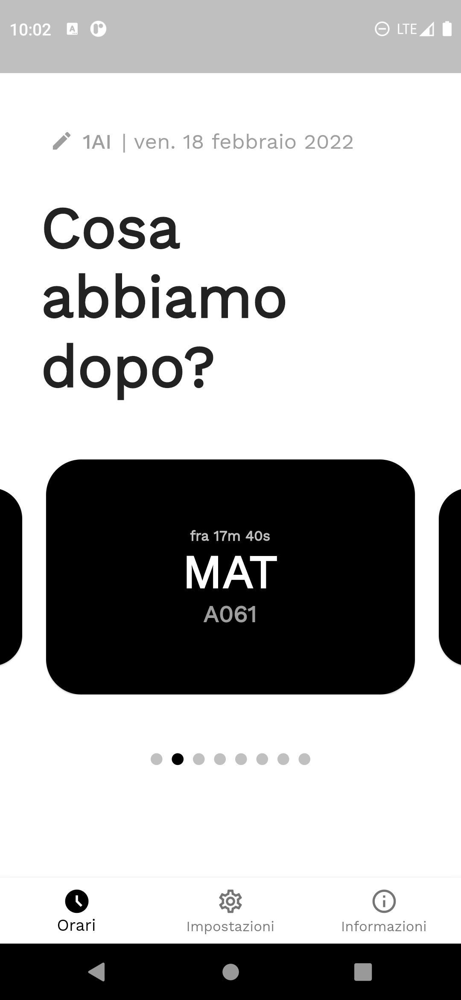
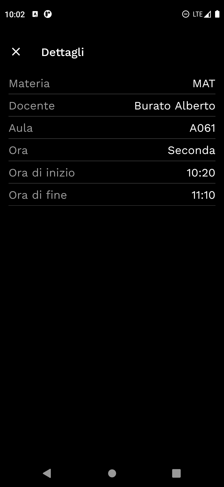
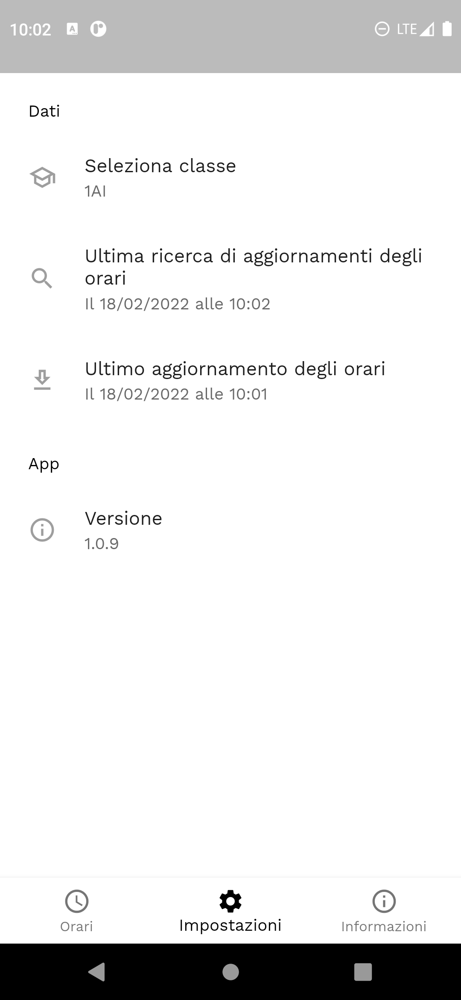

### ([ENG version](#whats-later))

# Cosa abbiamo dopo?

    

 

  
  
  

 

## Chi è il creatore di quest'app?

Quest'app è stata realizzata da Lorenzo Di Berardino. Puoi contattarlo [qui](mailto:lorenzo.diberardino03@gmail.com).

 

## Come è nata l'idea per quest'app?
Chiunque, almeno una volta nella propria vita scolastica, si è posto, o ha posto a qualcuno, la domanda che dà il titolo a quest'app.

Quest'app, realizzata specificatamente per il nostro istituto (ITI G. Marconi), giunge in supporto a coloro che vogliono avere una risposta a quella domanda in modo semplice e veloce.

 

## Come funziona quest'app?
Il suo funzionamento è rapido e intuitivo: basta aprirla.

Verranno ricercati automaticamente aggiornamenti per gli orari, in base a quanto pubblicato dalla scuola, e verranno mostrati questi ultimi con una grafica semplice e minimale.

 

## È richiesta una connessione a Internet attiva per utilizzare l'app?
Per mantenere un'esperienza sempre ottimale, l'app controlla ad ogni avvio la presenza di aggiornamenti. 

Se non fosse disponibile una connessione ad Internet l'app permetterà di visualizzare (eventuali) orari salvati precedentemente.

 

## Su quali piattaforme è disponibile quest'app?

L'app installabile è disponibile solo su Android. 

È, tuttavia, disponibile anche una sua versione sotto forma di WebApp (PWA), dunque raggiungibile da qualsiasi dispositivo avente un browser.

 

## Quest'app contiene un virus?
No, fa solo quello per cui è stata pensata. Niente malware, trojan, ransomware o miner di Bitcoin.

Ma se vuoi controllare personalmente puoi navigare nel codice qui sopra.

 

## Posso segnalare un problema?

Certamente, cercherò di risolverlo nel minor tempo possibile rilasciando un aggiornamento. 

Puoi contattarmi all'indirizzo indicato nella prima sezione o, se sai come fare, aprendo un <i>Issue</i> o una <i>Pull request</i> da questa pagina.

 

## Licenza

Quest'app è distribuita sotto la Licenza MIT.

 

---

 

### ([versione ITA](#cosa-abbiamo-dopo))

# What's later?

## Who's the creator of this app?

This app was made by Lorenzo Di Berardino. You can contact him [here](mailto:lorenzo.diberardino03@gmail.com).

 

## How did the idea for this app come about?
Anyone, at least once in their school life, has asked themselves or someone else the question that gives this app its title.

This app, made specifically for our school (ITI G. Marconi), comes in support of those who want to have an answer to that question in a simple and fast way.

 

## How does this app work?
Its operation is quick and intuitive: just open it.

Updates for schedules will be searched automatically, based on what the school has published, and will be shown with a simple and minimal graphics.

 

## Is an active Internet connection required to use the app?
To maintain an optimal experience at all times, the app checks for updates each time it is launched. 

If an Internet connection is not available, the app will display (any) previously saved schedules.

 

## What platforms is this app available on?

The installable app is only available on Android. 

However, a version of the app is also available as a WebApp (PWA), which can be accessed from any device with a browser.

 

## Does this app contain a virus?
No, it just does what it's designed to do. No malware, trojans, ransomware or bitcoin miners.

But if you want to check it out for yourself, you can browse the code above.

 

## Can I report a problem?

Certainly, I will try to solve it as soon as possible by releasing an update. 

You can contact me at the address given in the first section or, if you know how, by opening an <i>Issue</i> or a <i>Pull request</i> from this page.

 

## License

This app is distributed under MIT Licence.

